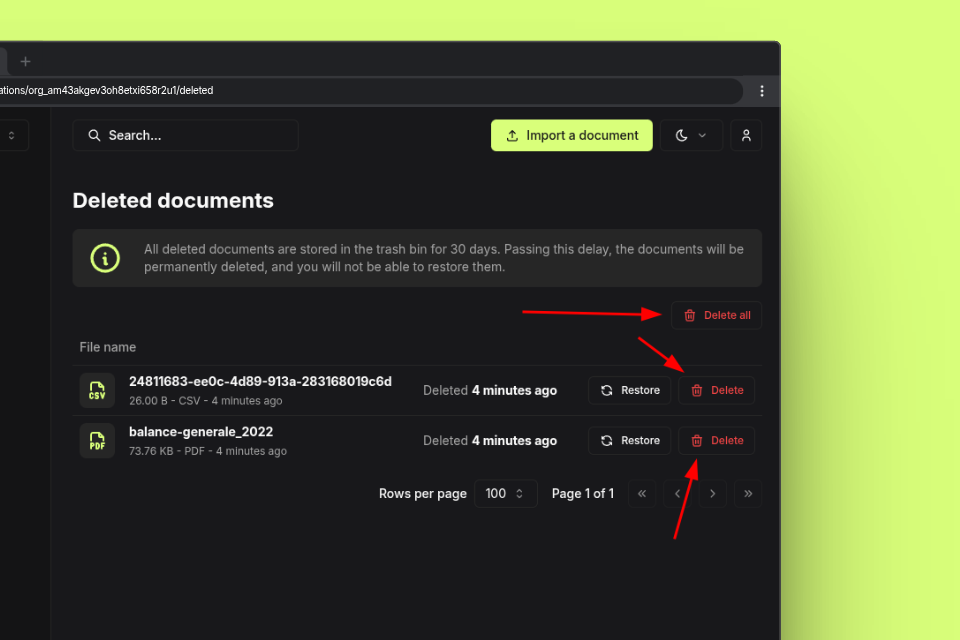

I'm really excited to announce the release of Papra v0.3! This is the first release of major features since the initial beta release of Papra. 


## Auto tagging rules

This release introduces **auto tagging rules**. This allows you to define rules that will automatically tag your files based on their content on ingestion.

For example, you can define a rule that will tag add the `invoice` tag to all files that contain the word `invoice` in their name. Then when a file is added (from any source, email intake, manual upload, or folder ingestion), it will automatically be tagged with the `invoice` tag.


## Folder ingestion

One of the most awaited features in this release is the **folder ingestion** feature. 
This feature allows you to bind a folder to your Papra instance and automatically ingest all the files added to that folder.

It'll allow you to setup ingestion from your scanner or any other source that can write files to a folder.

Just add the following environment variable to your `.env` or `docker-compose.yml` file:

```.env
INGESTION_FOLDER_IS_ENABLED=true
```

and bind the `/app/ingestion` folder to one of your folders in your `docker-compose.yml` file:

```yaml
volumes:
  - ./ingestion:/app/ingestion
```

## Emptying the trash

You can now manually empty the trash from the UI. Either delete one file at a time or empty the whole trash.

> **Note:** It's not possible to restore files from the trash once they are permanently deleted. So be careful when emptying the trash.



## Upload status popup

An upload status popup has been added to the UI. This will show you the status of your uploads and allow you to know when the upload is complete or if there was an error.


## Other changes

- **Improved deduplication**: now when you upload the same file as one in the trash, the file in the trash will be restored and updated with the new metadata.
- **Configuration**: upload file size limit can now be disabled in the configuration by setting `DOCUMENT_STORAGE_MAX_UPLOAD_SIZE` to `0`.
- **Improved the docs**: the documentation has been improved with better examples and explanations.
- Other minor bug fixes and improvements.

You can find more details in [the release changelog](https://github.com/papra-hq/papra/releases/tag/v0.3.0).

## Conclusion

Papra v0.3 is one of many releases to come!

Thank you for your support and precious feedbacks! If you have any suggestions, you can either open an issue on [GitHub](https://github.com/papra-hq/papra/issues) or join the [Discord server](https://papra.app/discord).

If you want to support the development of Papra, you can [buy me a coffee](https://buymeacoffee.com/cthmsst), or just [star the GitHub repository](https://github.com/papra-hq/papra), it'll help me a lot!

I'm looking forward to hearing from you!


<div class="mt-14">
Some useful links:
- [v0.3 release](https://github.com/papra-hq/papra/releases/tag/v0.3.0)
- [Discord server](https://papra.app/discord)
- [GitHub repository](https://github.com/papra-hq/papra)
- [Buy me a coffee](https://buymeacoffee.com/cthmsst)
- [Bluesky account](https://bsky.app/profile/papra.app)
- [Roadmap](https://github.com/orgs/papra-hq/projects/2)
</div>