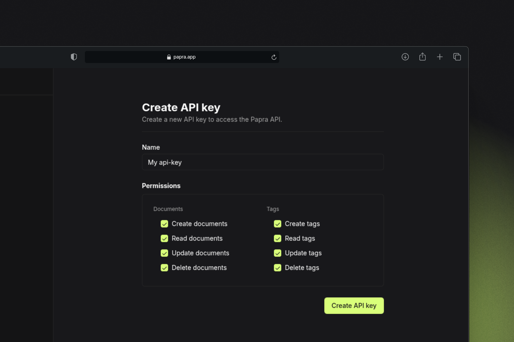
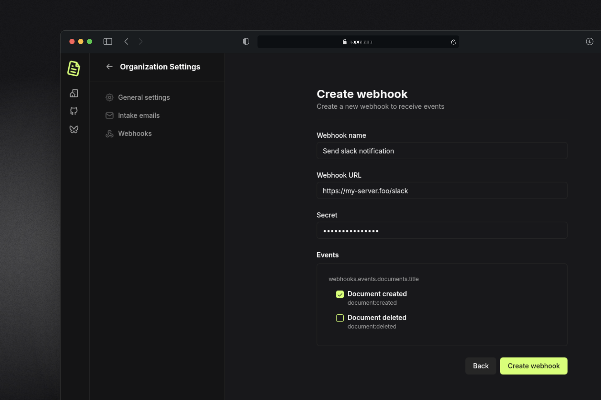

I'm thrilled to announce the release of Papra v0.4! This release focuses on empowering developers with new tools and integrations to build powerful solutions with Papra.

## Developer Tools

### API Keys

This release introduces **API keys**, allowing you to securely interact with Papra's API. You can create and manage API keys from your user settings page. Each key can have different permissions, making it easy to control access to your documents.




To use the API, simply include your API key in the `Authorization` header, for example, in a curl request:

```bash
curl -X POST https://your-papra-instance/api/organizations/<organization-id>/documents \
  -H "Authorization: Bearer <your-api-key>" \
  -H "Content-Type: multipart/form-data" \
  -F "file=@invoice.pdf" 
```


### TypeScript/JavaScript SDK

For JavaScript and TypeScript developers, we've created a **first-party SDK** that makes it easy to integrate Papra into your applications. The SDK provides a type-safe way to interact with Papra's API, with full TypeScript support. 
The SDK is available on npm and pnpm: [@papra/api-sdk](https://www.npmjs.com/package/@papra/api-sdk).

```bash
pnpm install @papra/api-sdk
# or
npm install @papra/api-sdk
# or
yarn add @papra/api-sdk
```


```typescript
import { createClient } from '@papra/api-sdk';

const client = createClient({
  // The API key can be found in your user settings (under /api-keys)
  // you may want to store this in an environment variable
  apiKey: 'ppapi_...',

  // Optional: base URL of the API
  apiBaseUrl: 'http://papra.your-instance.tld',
});

const myFile = new File(['test'], 'test.txt', { type: 'text/plain' });

await client.uploadDocument({
  file: myFile,
  organizationId: 'org_...', // The id of the organization you want to upload the document to
});
```

You can also scope the client to a specific organization:

```typescript
const client = createClient({ apiKey, apiBaseUrl }).forOrganization('org_...');

await client.uploadDocument({ file });
```

### Organization Webhooks

**Organization webhooks** allow you to receive real-time events from your Papra instance. You can now subscribe to events like document creation and deletions, more events will be added in the future.



You can create webhooks in the web interface, under the organization settings.

Each webhook payload includes:
- The event type
- A timestamp
- The resource data (document, tag, etc.)

Example webhook payload:
```json
{
  "event": "document:created",
  "payload": {
    "documentId": "doc_if13q6qstj8yirmktt9mlnxe",
    "organizationId": "org_mnpl09j43uvqmcde4aob2lq3",
    "name": "37627603eu.pdf",
    "createdAt": "2025-05-13T18:08:47.607Z",
    "updatedAt": "2025-05-13T18:08:47.607Z"
  },
  "timestampMs": 1747159727627
}
```

Each payload is signed with a secret key, the signature is a HMAC-SHA256 hash of the payload and the secret key and can be found in the `X-Signature` header.
For convenience, and easy integration and verification, we've published a package: [@papra/webhooks](https://www.npmjs.com/package/@papra/webhooks) that can be used to consume and verify the webhook events (and trigger dummy events for testing).

```bash
pnpm install @papra/webhooks
# or
npm install @papra/webhooks
# or
yarn add @papra/webhooks
```

If you want to use the webhooks package, you can do something like this:

```typescript
import { createWebhooksHandler } from '@papra/webhooks';

const webhookHandler = createWebhooksHandler({ secret: 'secret' });

webhookHandler.on('document:created', (payload) => {
  console.log('Document created', payload);
});

// ...
// In your server, handle the webhook event

// Get the body and signature from the http request
const bodyBuffer = request.body;
const signature = request.headers['x-signature'];

webhookHandler.handle({ bodyBuffer, signature });
```

### Command Line Interface

The new **Papra CLI** makes it easy to manage your Papra instance from the command line. You can perform common operations like uploading documents, managing tags, and configuring your instance.

For the moment, the CLI is only available as a npm package: [@papra/cli](https://www.npmjs.com/package/@papra/cli).

```bash
# Install the CLI
pnpm install -g @papra/cli
# or
npm install -g @papra/cli
# or
yarn add -g @papra/cli
```

And you can use it to import documents:

```bash
# Initialize the CLI, you'll be prompted to enter your
# API key and instance base URL
papra config init

# Import a document
papra documents import -o <organization-id> <file-path>

```

For more information about any command, you can use the `--help` flag:

```bash
papra --help
papra config --help
papra documents --help
```

## Changes in versioning/release process

Papra will now use [changesets](https://github.com/changesets/changesets) to manage releases and no longer sync all monorepo packages on the same version, nor use the v prefix for the version.

Now, each package release will be tagged with the package name and the version, like `@papra/api-sdk@0.1.0`.

See the [releases page](https://github.com/papra-hq/papra/releases) for the latest releases.

## New file storage drivers

New file storage drivers have been added to Papra, you were able to use the **fs**, **s3**, and **memory** drivers, and now we've added:
- **Backblaze B2**
- **Azure Blob Storage**

## Other Improvements

- **Document Search**: Edit searchable content for better document discovery
- **Tag Management**: Added tag creation button in the document page
- **File Handling**: Improved handling of files without extensions
- **Storage**: Properly hard delete files in storage driver
- **Document Count**: Excluded deleted documents from document count
- **Configuration**: Fixed ingestion config coercion
- **And more!**

## Conclusion

Papra v0.4 marks a significant step forward in making the platform more developer-friendly. With the new API, SDK, CLI, and webhooks, you can now build powerful integrations and automate your document management workflows.

Thank you for your continued support and valuable feedback! If you have any suggestions, you can either open an issue on [GitHub](https://github.com/papra-hq/papra/issues) or join the [Discord server](https://papra.app/discord).

If you want to support the development of Papra, you can [buy me a coffee](https://buymeacoffee.com/cthmsst), or just [star the GitHub repository](https://github.com/papra-hq/papra), it'll help me a lot!

I'm looking forward to hearing from you!

<div class="mt-14">
Some useful links:
- [Discord server](https://papra.app/discord)
- [GitHub repository](https://github.com/papra-hq/papra)
- [Buy me a coffee](https://buymeacoffee.com/cthmsst)
- [Bluesky account](https://bsky.app/profile/papra.app)
- [Roadmap](https://github.com/orgs/papra-hq/projects/2)
</div> 