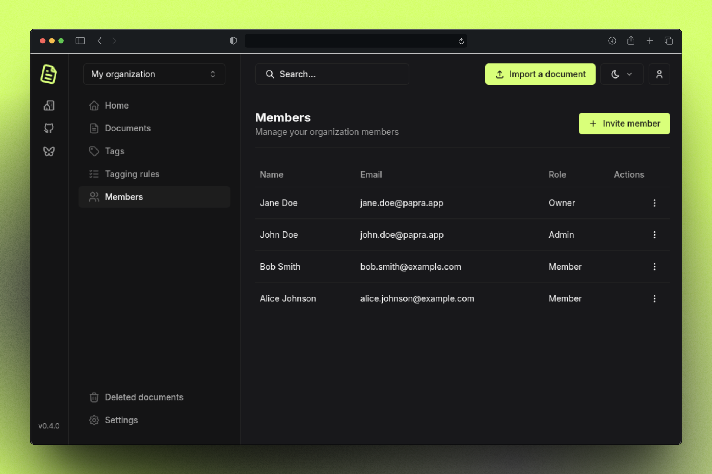

I'm excited to announce the release of Papra v0.5! This release focuses on improving collaboration and making Papra more accessible to teams and organizations.

## Organization Invitations

This release introduces a new **invitation and membership management system** that makes it easy to add users to your organization. You can now invite users by email, and they'll receive an in-app invitation to join your organization (and an email notification if configured).


The invitation system includes:
- Optional email notifications for invitations
- Role-based invitations (admin, member)
- In-app membership management



## Custom OAuth2/OIDC Providers

Papra now supports **custom OAuth2 and OIDC providers**, allowing you to integrate with your existing authentication infrastructure. This makes it easier to deploy Papra in enterprise environments where you might be using services like Azure AD, Okta, or other self-hosted identity providers.

You can configure custom providers by adding them to your environment variables:

```env
AUTH_PROVIDERS_CUSTOMS='[
  {
    "providerId": "custom-oauth2",
    "providerName": "Custom OAuth2",
    "providerIconUrl": "https://api.iconify.design/tabler:login-2.svg",
    "clientId": "your-client-id",
    "clientSecret": "your-client-secret",
    "type": "oidc",
    "discoveryUrl": "https://your-provider.tld/.well-known/openid-configuration",
    "scopes": ["openid", "profile", "email"]
  }
]'
```

For more details on setting up custom OAuth2 providers, check out our [dedicated guide](https://docs.papra.app/guides/setup-custom-oauth2-providers/).

## Improved Deployment Tools

### Docker Compose Generator

We've added a new **Docker Compose Generator** to our documentation website that makes it easy to generate a custom `docker-compose.yml` file for your Papra instance. The generator allows you to:

- Choose your preferred image source
- Configure service name and port
- Set up authentication secret
- Enable/disable features like ingestion folder
- Configure intake emails
- And more!

You can find the generator at [docs.papra.app/docker-compose-generator](https://docs.papra.app/docker-compose-generator/).

### Database Directory Check

Papra now ensures that the local database directory exists on boot, preventing potential issues with database initialization. This is especially helpful for users who are setting up Papra for the first time.

## Conclusion

Papra v0.5 makes it easier than ever to collaborate with your team and integrate Papra into your existing infrastructure. With organization invitations and custom OAuth2 providers, you can now deploy Papra in more environments and scale your document management workflows.

Thank you for your continued support and valuable feedback! If you have any suggestions, you can either open an issue on [GitHub](https://github.com/papra-hq/papra/issues) or join the [Discord server](https://papra.app/discord).

If you want to support the development of Papra, you can [buy me a coffee](https://buymeacoffee.com/cthmsst), or just [star the GitHub repository](https://github.com/papra-hq/papra), it'll help me a lot!

I'm looking forward to hearing from you!

<div class="mt-14">
Some useful links:
- [Discord server](https://papra.app/discord)
- [GitHub repository](https://github.com/papra-hq/papra)
- [Buy me a coffee](https://buymeacoffee.com/cthmsst)
- [Bluesky account](https://bsky.app/profile/papra.app)
- [Roadmap](https://github.com/orgs/papra-hq/projects/2)
</div> 