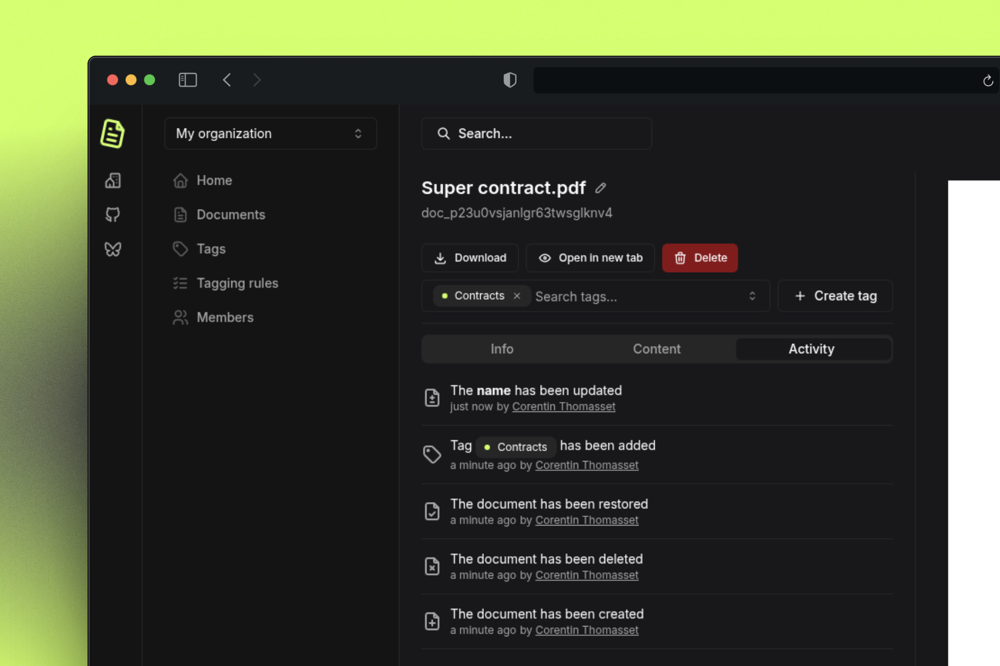
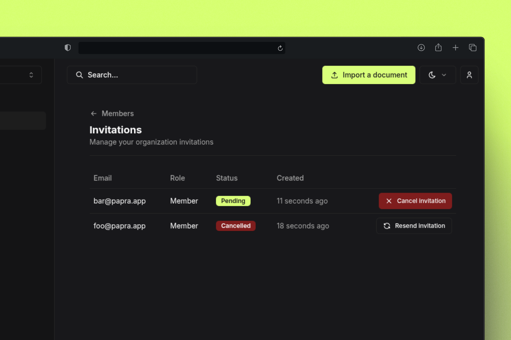

I'm excited to announce the release of Papra v0.6! This release focuses on improving transparency, collaboration, and accessibility with activity tracking, enhanced invitation management, and full internationalization support.

## Document Activity Log

One of the biggest additions in v0.6 is the **document activity log**. You can now track all actions performed on your documents, giving you complete visibility into who did what and when.

The activity log captures:
- Document creation
- Tag additions and removals
- Document deletions
- Document updates (content, renames, etc.)

This feature is particularly valuable for teams that need to maintain audit trails or simply want better insight into how their documents are being used.



## Enhanced Invitation Management

We've significantly improved the **invitation management system** with a dedicated pending invitations page. Organization administrators can now:

- View all pending invitations in one place
- Resend invitations that may have been missed
- Cancel invitations that are no longer needed
- Track invitation status

This makes it much easier to manage team onboarding and ensure that all the right people have access to your organization.



## Improved Email System

We've completely **reworked the email sending system** to be more flexible and modular. The new system supports multiple email drivers, allowing you to choose the best option for your deployment:

- **SMTP driver**: For traditional SMTP servers
- **Logger driver**: For development and testing (logs emails instead of sending)
- **Resend driver**: Uses the Resend API to send emails
- ...and the possibility to easily add more drivers!

The configuration is now more straightforward:

```env
# Use logger driver for development (default)
EMAILS_DRIVER=logger
```

```env
# Use SMTP driver for production
EMAILS_DRIVER=smtp
SMTP_HOST=your-smtp-server.com
SMTP_PORT=587
SMTP_USER=your-username
SMTP_PASSWORD=your-password
SMTP_SECURE=true

# Or for complex nodemailer configs
# see https://nodemailer.com/smtp/ for more details
EMAILS_DRIVER=smtp
SMTP_JSON_CONFIG={ ... }
```

```env
# Use Resend driver for production
EMAILS_DRIVER=resend
RESEND_API_KEY=your-resend-api-key
```

> **Note**: The `EMAILS_DRY_RUN` environment variable has been removed. Use `EMAILS_DRIVER=logger` (or any other driver) instead to log emails without sending them.

## Other Improvements

- Full French language support
- Added document renaming
- Improved error handling for tag creation
- Cleaned a bug that was preventing users from accessing the password reset page
- Updated the default value of `CLIENT_BASE_URL` to `http://localhost:1221` in Dockerfiles
- Updated dependencies
- ...and more!

## Conclusion

Thank you for your continued support and valuable feedback! If you have any suggestions, you can either open an issue on [GitHub](https://github.com/papra-hq/papra/issues) or join the [Discord server](https://papra.app/discord).

If you want to support the development of Papra, you can [buy me a coffee](https://buymeacoffee.com/cthmsst), or just [star the GitHub repository](https://github.com/papra-hq/papra), it'll help me a lot!

I'm looking forward to hearing from you!

<div class="mt-14">
Some useful links:
- [Discord server](https://papra.app/discord)
- [GitHub repository](https://github.com/papra-hq/papra)
- [Buy me a coffee](https://buymeacoffee.com/cthmsst)
- [Bluesky account](https://bsky.app/profile/papra.app)
- [Roadmap](https://github.com/orgs/papra-hq/projects/2)
</div> 