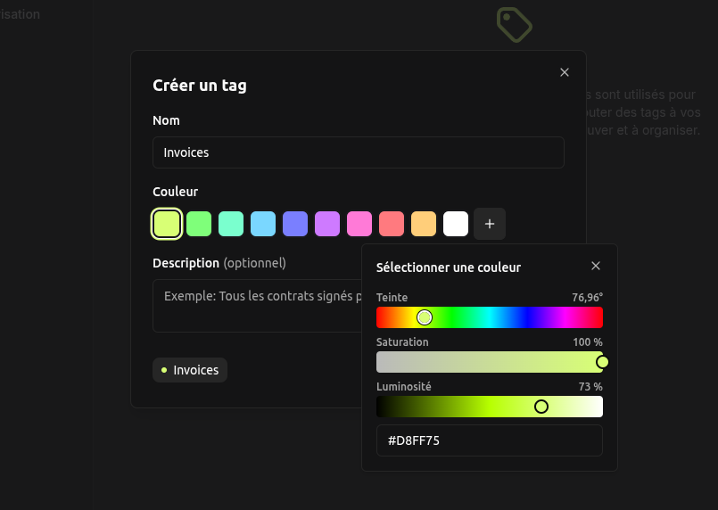

I'm excited to announce the release of Papra v0.7! This release focuses on improving the user experience with better file previews, enhanced authentication options, and significantly expanded internationalization support.

## Enhanced File Previews

We improved the file previews in v0.7, you can now preview a wider range of text files including:

- Configuration files (`.env`, `.yaml`, `.yml`, `.json`)
- Script files (`.sh`, `.bash`, `.py`, `.js`, `.ts`)
- Documentation files (`.md`, `.txt`)
- Files without extensions that contain text content

This makes it much easier to review and understand your documents without having to download them first.

## SSO-Only Authentication

For setups that rely entirely on Single Sign-On (SSO), we've added the ability to **disable email-based authentication**. This is particularly useful for setups that already have a SSO provider.

You can configure this by setting the following environment variable:

```bash
AUTH_PROVIDERS_EMAIL_IS_ENABLED=false
```

When disabled, users will only be able to authenticate through your configured OAuth2/OIDC providers, ensuring consistent authentication across your setup.

## App Base URL for Simplified Configuration

We've added the `APP_BASE_URL` environment variable to simplify the configuration of Papra, when set, it'll override the `SERVER_BASE_URL` and `CLIENT_BASE_URL` environment variables.

You can configure this by setting the following environment variable:

```bash
APP_BASE_URL=https://papra.example.com
```

When set, Papra will use this URL as the base URL for all links and redirects.

## Tag Color Customization

We've introduced **tag color swatches and a color picker** to make tag management more visual and intuitive. You can now:

- Choose from predefined color swatches
- Use a color picker for custom colors
- See color previews when creating or editing tags



## API Documentation

For developers integrating with Papra, we've added a **comprehensive API endpoints documentation**.

You can access the API documentation [in the documentation website](https://docs.papra.app/resources/api-endpoints/).

## OCR Language Configuration

We've added **configurable OCR language support** to improve text extraction accuracy for documents in different languages. You can now specify which languages the OCR engine should recognize:

```bash
# Set the default ocr language to French
DOCUMENTS_OCR_LANGUAGES=fra

# Set the default ocr language to French, English and German
DOCUMENTS_OCR_LANGUAGES=fra,eng,deu
```

This is particularly useful for organizations working with multilingual documents, as it significantly improves the accuracy of text extraction and search functionality.

## Expanded Language Support

Papra v0.7 adds support for **6 new languages**, bringing the total to 8 supported languages:

- **Spanish** (es)
- **Polish** (pl)
- **Brazilian Portuguese** (pt-BR)
- **European Portuguese** (pt)
- **Romanian** (ro)

This makes Papra more accessible to users worldwide and supports organizations with international teams.

## Bug Fixes and Improvements

- **Fixed back to organization link** in organization settings
- **Resolved 400 error** when submitting tags with uppercase hex color codes
- **Fixed weird centering** in document page for long filenames
- **Corrected invalid domain** in documentation JSON schema URLs
- **Fixed permission issue** for non-1000:1000 rootless users

## What's next?

While working on Papra, I've been developing a new open-source project that can be useful for Node.js developers: **[CadenceMQ](https://github.com/papra-hq/cadence-mq)**. It's a backend-agnostic Node.js job queue library built with self-hosting in mind.

### Why CadenceMQ?

When building applications like Papra, you often need to run background jobs (sending emails, processing files, etc.). Most existing job queue libraries are tied to specific databases like Redis, which adds complexity for self-hosted setups. CadenceMQ solves this by being backend-agnostic - you can start with SQLite for simplicity and scale to distributed databases when needed.

### Key features
- **Backend agnostic** - Works with SQLite, LibSQL, and more
- **Self-hosted friendly** - No additional servers required
- **Scalable** - From simple setups to production workloads
- **TypeScript support** - Full type safety
- **Open source** - MIT licensed

It's still in early development, but if you're building applications that need background job processing, check out [CadenceMQ on GitHub](https://github.com/papra-hq/cadence-mq).

## Supporting Papra Development

I'm excited to announce that Papra now has a dedicated **[GitHub Sponsors page](https://github.com/sponsors/papra-hq)**! 

Your sponsorship helps support infrastructure costs, feature development, and community growth. While Papra will always remain free, your support ensures it stays sustainable and feature-rich.

Thank you for supporting independent open-source development!

## Conclusion

Papra v0.7 continues our focus on improving usability and accessibility. With enhanced file previews, SSO-only authentication, and expanded language support, Papra is now more versatile and user-friendly than ever.

Thank you for your continued support and valuable feedback! If you have any suggestions, you can either open an issue on [GitHub](https://github.com/papra-hq/papra/issues) or join the [Discord server](https://papra.app/discord).

If you want to support the development of Papra, you can [buy me a coffee](https://buymeacoffee.com/cthmsst), or just [star the GitHub repository](https://github.com/papra-hq/papra), it'll help me a lot!

I'm looking forward to hearing from you!

<div class="mt-14">
Some useful links:
- [Discord server](https://papra.app/discord)
- [GitHub repository](https://github.com/papra-hq/papra)
- [Buy me a coffee](https://buymeacoffee.com/cthmsst)
- [Bluesky account](https://bsky.app/profile/papra.app)
- [Roadmap](https://github.com/orgs/papra-hq/projects/2)
</div> 